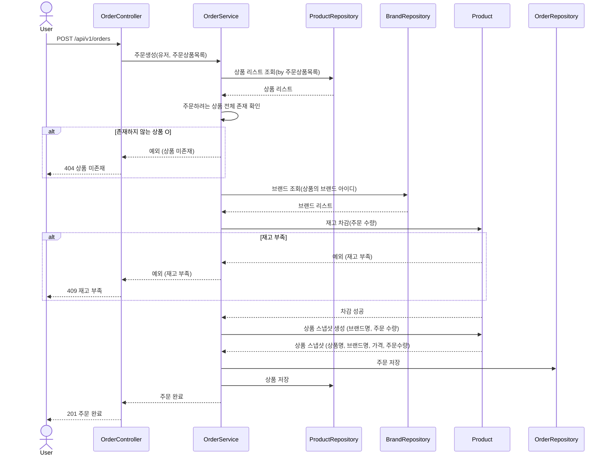
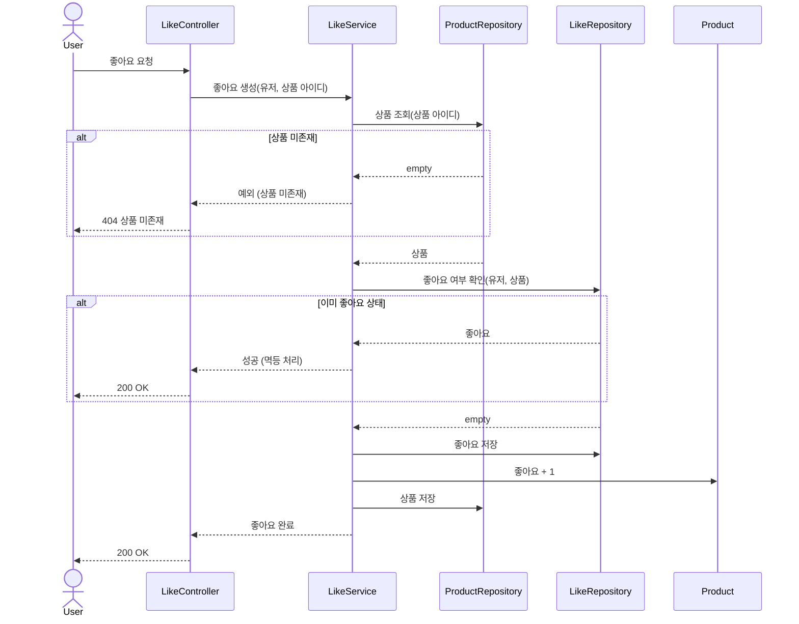
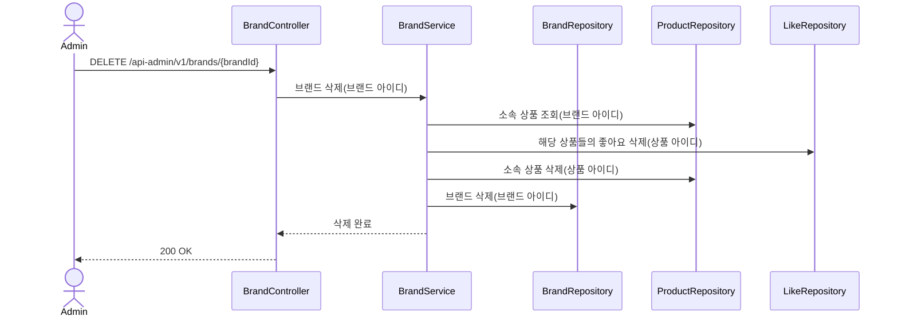

# 시퀀스 다이어그램

## 1. 주문 요청

상품 존재 검증 → 재고 확인 → 재고 차감 → 스냅샷 생성 → 주문 저장.

**핵심 포인트**:
- 재고 부족 시 전체 주문 거부, 부분 차감 없음
- 브랜드명은 Brand에서 조회하여 스냅샷에 포함
- 주문 스냅샷에 주문 시점의 상품명, 브랜드명, 가격을 저장

---

## 2. 좋아요 등록

상품 존재 확인 → 중복 확인 → 좋아요 저장 → 좋아요 수 갱신.

**핵심 포인트**:
- 이미 좋아요한 경우 카운트 갱신 없이 성공 반환 (멱등)

---

## 3. 브랜드 삭제

브랜드 소속 상품의 좋아요 삭제 → 브랜드 소속 상품 삭제 -> 브랜드 삭제

**핵심 포인트**:
- 브랜드 삭제 시 소속 상품과 해당 상품의 좋아요가 함께 삭제된다
- 브랜드 미존재 시에도 삭제 완료로 처리 (멱등)
