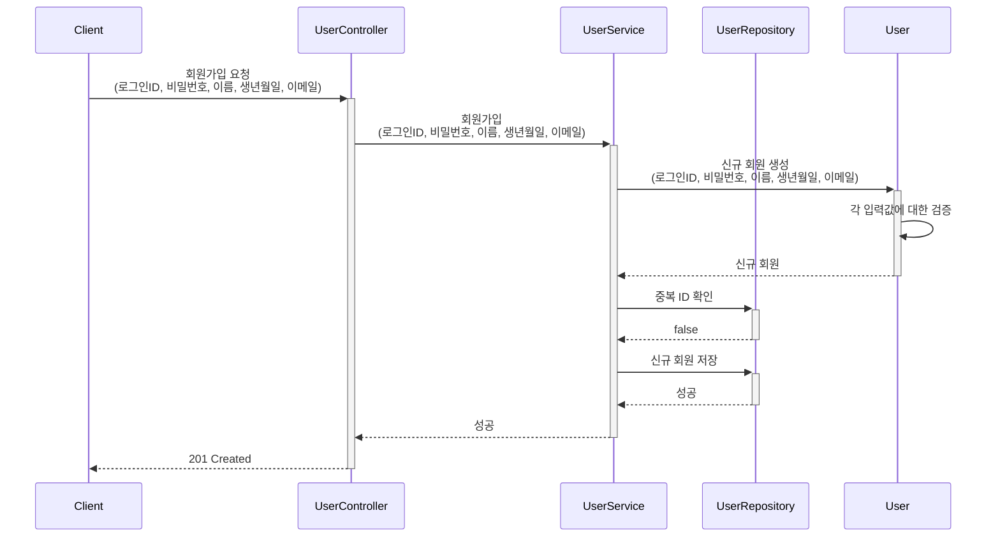
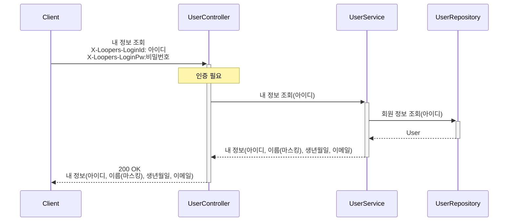
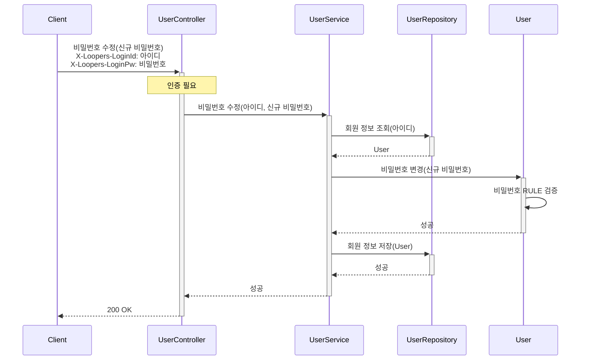
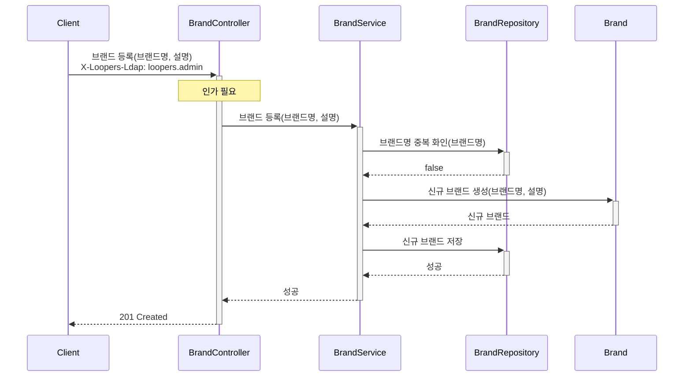
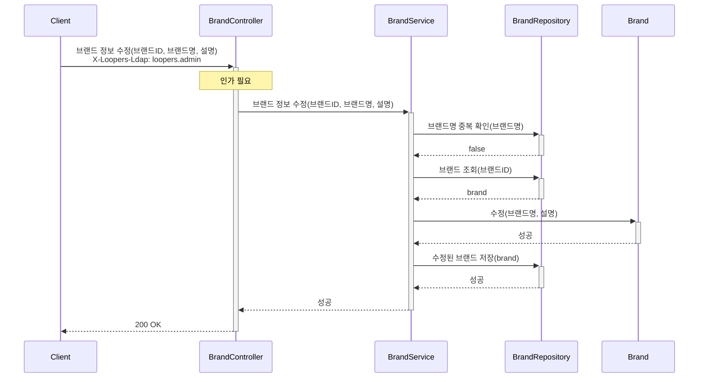
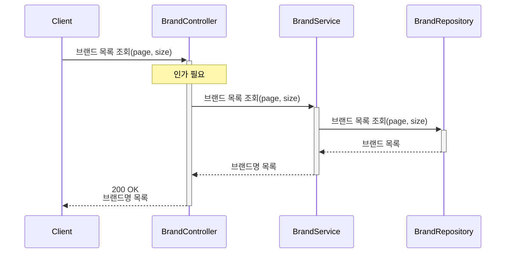
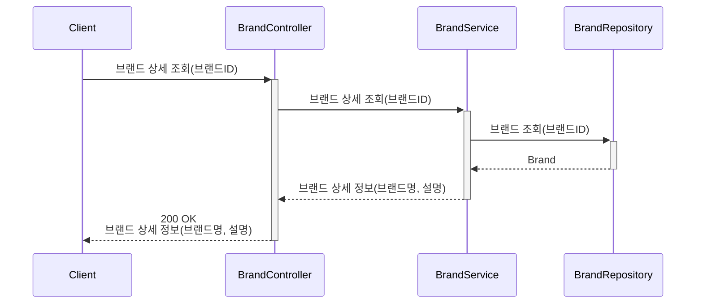
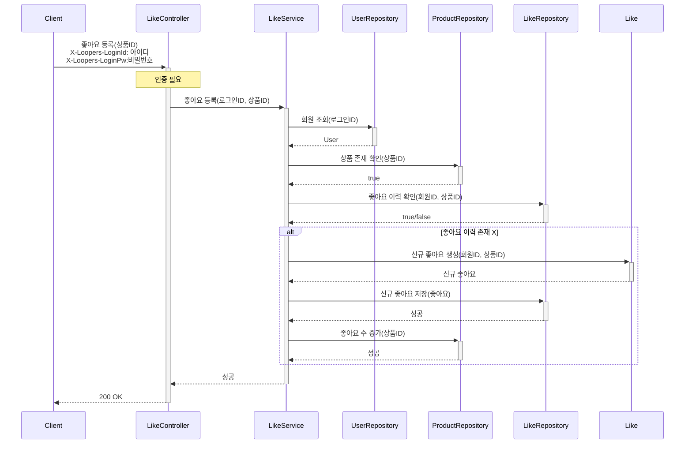
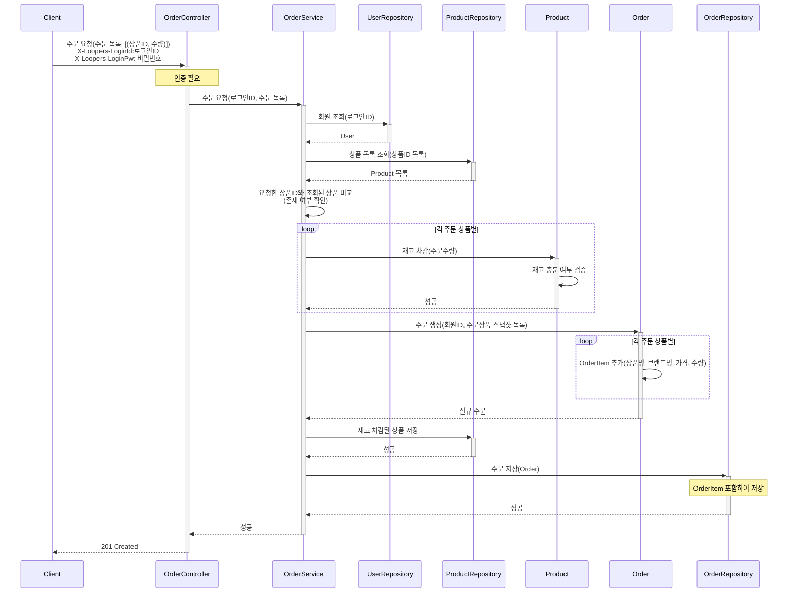

## 시퀀스 다이어그램
- 각 기능 흐름에서 Happy Case 가 아닌 사항(조건/분기에 따른 별도 예외 흐름) 등은 시퀀스 다이어그램에 표현하지 않습니다.

## 도메인 별 시퀀스 다이어그램
### 회원
#### 1. 회원가입

 

#### 2. 내 정보 조회

 

#### 3. 비밀번호 수정

 

### 브랜드/상품
#### 1. 브랜드 등록

 

#### 2. 브랜드 정보 수정

 

#### 3. 등록된 브랜드 목록 조회

 

#### 4. 브랜드 상세 조회

 

그 외 생략...
 

### 좋아요
#### 1. 좋아요 등록

 

그 외 생략...
 

### 주문
#### 1. 주문 요청

 

그 외 생략...