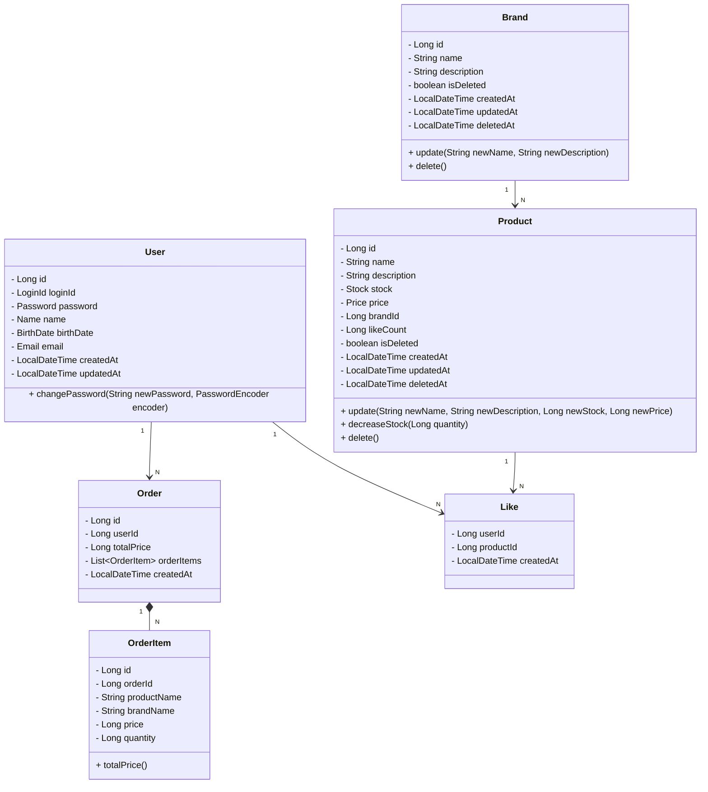

# 클래스 다이어그램

---

```mermaid
classDiagram
    class User {
        - Long id
        - LoginId loginId
        - Password password
        - Name name
        - BirthDate birthDate
        - Email email
        - LocalDateTime createdAt
        - LocalDateTime updatedAt
        + changePassword(String newPassword, PasswordEncoder encoder)
    }
    
    class Brand {
        - Long id
        - String name
        - String description
        - boolean isDeleted
        - LocalDateTime createdAt
        - LocalDateTime updatedAt
        - LocalDateTime deletedAt
        + update(String newName, String newDescription)
        + delete()
    }
    
    class Product {
        - Long id
        - String name
        - String description
        - Stock stock
        - Price price
        - Long brandId
        - Long likeCount
        - boolean isDeleted
        - LocalDateTime createdAt
        - LocalDateTime updatedAt
        - LocalDateTime deletedAt
        + update(String newName, String newDescription, Long newStock, Long newPrice)
        + decreaseStock(Long quantity)
        + delete()
    }
    
    class Like {
        - Long userId
        - Long productId
        - LocalDateTime createdAt
    }
    
    class Order {
        - Long id
        - Long userId
        - Long totalPrice
        - List~OrderItem~ orderItems
        - LocalDateTime createdAt
    }
    
    class OrderItem {
        - Long id
        - Long orderId
        - String productName
        - String brandName
        - Long price
        - Long quantity
        + totalPrice()
    }

    User "1" --> "N" Order
    User "1" --> "N" Like
    Order "1" *-- "N" OrderItem
    Product "1" --> "N" Like
    Brand "1" --> "N" Product
```