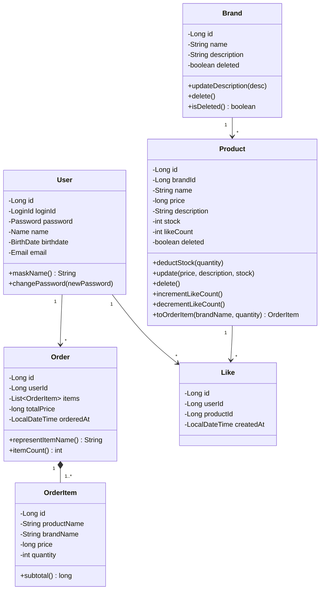

# 클래스 다이어그램

---

```mermaid
classDiagram
    class User {
        -Long id
        -LoginId loginId
        -Password password
        -Name name
        -BirthDate birthdate
        -Email email
        +maskName() String
        +changePassword(newPassword)
    }

    class Brand {
        -Long id
        -String name
        -String description
        -boolean deleted
        +updateDescription(desc)
        +delete()
        +isDeleted() boolean
    }

    class Product {
        -Long id
        -Long brandId
        -String name
        -long price
        -String description
        -int stock
        -int likeCount
        -boolean deleted
        +deductStock(quantity)
        +update(price, description, stock)
        +delete()
        +incrementLikeCount()
        +decrementLikeCount()
        +toOrderItem(brandName, quantity) OrderItem
    }

    class Order {
        -Long id
        -Long userId
        -List~OrderItem~ items
        -long totalPrice
        -LocalDateTime orderedAt
        +representItemName() String
        +itemCount() int
    }

    class OrderItem {
        -Long id
        -String productName
        -String brandName
        -long price
        -int quantity
        +subtotal() long
    }

    class Like {
        -Long id
        -Long userId
        -Long productId
        -LocalDateTime createdAt
    }

    Brand "1" --> "*" Product
    Order "1" *-- "1..*" OrderItem
    User "1" --> "*" Order
    User "1" --> "*" Like
    Product "1" --> "*" Like
```