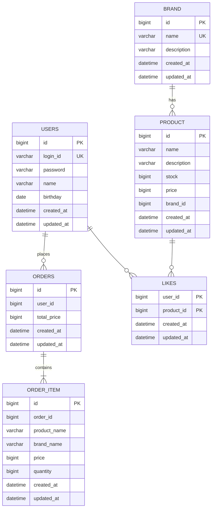

# ERD

> 영속성 구조 정의. 모든 관계선은 논리적 관계이며 DB에 물리적 FK는 생성하지 않음.
> 핵심 유니크 필드는 DB unique index 유지.

---

```mermaid
erDiagram
    USERS {
        bigint id PK
        varchar login_id UK
        varchar password
        varchar name
        date birthday
        datetime created_at
        datetime updated_at
    }
    
    BRAND {
        bigint id PK
        varchar name UK
        varchar description
        datetime created_at
        datetime updated_at
    }
    
    PRODUCT {
        bigint id PK
        varchar name
        varchar description
        bigint stock
        bigint price
        bigint brand_id
        datetime created_at
        datetime updated_at
    }
    
    LIKES {
        bigint user_id PK
        bigint product_id PK
        datetime created_at
        datetime updated_at
    }
    
    ORDERS {
        bigint id PK
        bigint user_id
        bigint total_price
        datetime created_at
        datetime updated_at
    }
    
    ORDER_ITEM {
        bigint id PK
        bigint order_id
        varchar product_name
        varchar brand_name
        bigint price
        bigint quantity
        datetime created_at
        datetime updated_at
    }

    USERS ||--o{ ORDERS : "places"
    USERS ||--o{ LIKES : ""
    ORDERS ||--|{ ORDER_ITEM : "contains"
    PRODUCT ||--o{ LIKES : ""
    BRAND ||--o{ PRODUCT : "has"
```